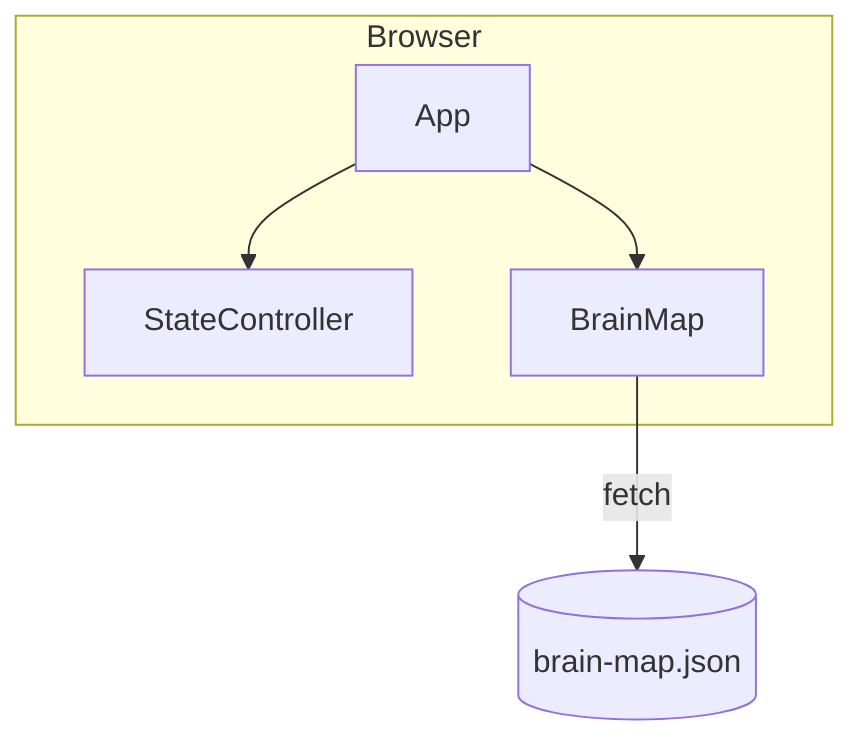

# Architecture Diagram

```mermaid
graph TD
  subgraph Browser
    App
    StateController
    BrainMap
  end
  App --> StateController
  App --> BrainMap
  BrainMap --> |fetch| BrainMapJSON[("brain-map.json")]
```

This diagram illustrates how the main React components relate to the static JSON data.
